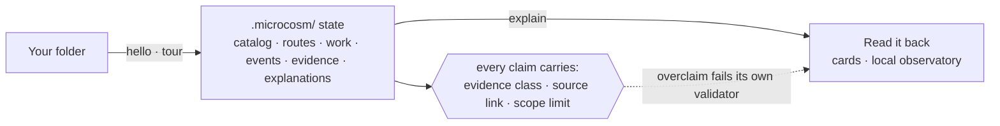
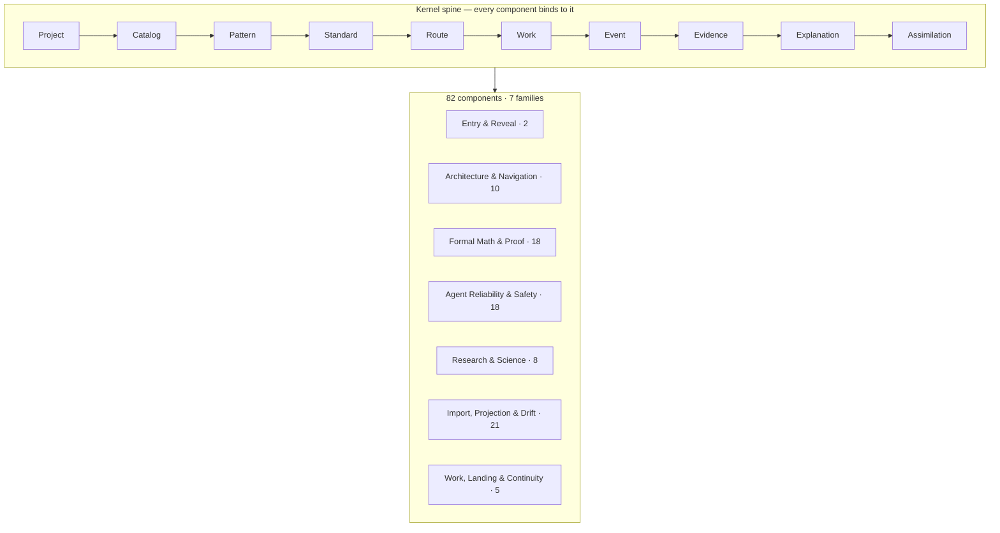

# Microcosm Substrate

> **Public shell only.** Source bodies are withheld. Security intake is live. The source-population switch has not been cleared.

This repository is the public shell for Microcosm: it resolves public links, names the release boundary, and provides a private security-intake route. It is not populated source.

## Release state

| Surface | State |
|---|---|
| Public shell | live |
| Reserved source paths | live |
| Security intake | live |
| Source bodies | withheld |
| License grant from this shell | not active |
| Full public source release | not authorized |
| Private working-system publication | forbidden |
| Allowed next action | read the shell, report a security issue, await population |
| Forbidden next action | populate, deploy, push source, announce a release |

> **This README is not the switch.** Do not infer release approval from the existence, polish, completeness, validation status, or diagrams in this file. The final public-access switch is operator-only (William Cook) and has not been cleared. A green rehearsal or a passing check is not the switch.

Read every section below against that table.

## What Microcosm is

The larger system keeps its thinking on disk: ideas, doctrine, standards, work state, generated projections, tests, and agent routing all live as files, so that humans and AI agents can re-enter the work without reconstructing it from a chat log.

Microcosm is a small, runnable slice of that, reorganised so a stranger can inspect the architecture, the evidence habits, and the claim limits on their own terms, without being handed the whole private system.

Its single discipline is that it refuses to collapse different questions into one green tick. Every claim it makes carries an evidence class (what *kind* of proof backs it), a link back to the source that produces the behaviour, and a scope limit naming what it does *not* prove. The rest of the system is that loop applied across its components.

## What this shell does now

- **Reserved paths.** The files here (for example `AGENTS.md`, `ARCHITECTURE.md`, `ORGANS.md`, `QUICKSTART.md`) are reserved public source paths. A path existing lets a documentation link resolve to a stable location. It does not mean the body has been released; the placeholders say so.
- **Link resolution.** Public writing about Microcosm (a site, a walkthrough, a paper) can point at these paths without breaking, while the source stays withheld.
- **Security intake.** Vulnerability reports go through GitHub Private Vulnerability Reporting, not public issues, so a report never has to be filed in the open. `SECURITY.md` is the human-readable policy; the private reporting route is the actual channel.

## What this shell is reserving space for

This section describes the *body* that the reserved paths are holding space for. None of it is runnable from this shell. It becomes true only after the source-population switch is cleared.

When populated, the source is meant to be enterable in one screen and one step: ask for the map, then run a single local command that will write a small record beside your own project and print what it found, what backs each count, and what it does not prove. From there the source will branch by reader: someone deciding whether to spend ten minutes, a safety or evaluation reviewer, a peer developer, or an AI agent arriving with a task.

## Architecture

**How it works.** Bring a folder; Microcosm builds project-local `.microcosm/` state and reads it back as cards and a local observatory. Every claim it makes carries an evidence class, a source link, and a scope limit.

**How it is built.** A 10-primitive kernel spine that every component binds to, grouped into seven families.

The directories in this repository publish the shape of that spine and those families as reserved paths; the component bodies populate them when the source-population switch is cleared.

## Security

`SECURITY.md` states the public boundary and what is excluded. Vulnerabilities should be reported privately through GitHub Private Vulnerability Reporting on this repository, not as public issues. The two are distinct: the policy file is the human-readable surface; private reporting is the live intake route.

## License and rights

Public visibility is not a license grant. No license is granted for any material that is not present in this repository, and the visible bodies are placeholders, so there is nothing here to reuse yet.

The license posture for any later populated source release is decided and recorded separately, before source bodies are published. The recorded intended posture for that populated source is:

- **License:** Apache License, Version 2.0.
- **Copyright** 2026 William Cook.
- The released artifact is the standalone Microcosm repository, its public site, and its walkthrough. The private working system is not released, licensed, or implied.

Apache-2.0 is a deliberate choice: it refuses artificial scarcity as a business model, so the released proof stays free to read and reuse under the licence terms. It does not rule out the project later being sustained by support, hosted evaluation, grants, or sponsorship.

Until the switch is cleared, read the rights posture as: all rights reserved, no warranty, research prototype, not for production use.

## A note from the author

This is an independent, AI-assisted solo research artifact, and the evidence discipline is part of the product. The system states what it checked, what kind of evidence stands behind each claim, and what it does not prove. The same rule is applied to its own release.

The clearest sign of that discipline is negative: the source is not released yet, because the author is still confirming it is safe to release and that it does what it claims. William Cook built it as an economics undergraduate, with heavy use of AI tools; that is stated plainly because hiding it would contradict the point.

If you are reviewing it, the ask is scrutiny, not endorsement.

## What this is not

Microcosm is a research prototype and a developer tool. It is not a hosted service, a production security product, a formal-correctness authority, a financial or trading system, professional advice of any kind, or an endorsement by any tool provider or institution. It does not call external model providers, mutate your source files, or claim whole-system correctness.

## Companion paths

| Path | Role in the shell |
|---|---|
| `AGENTS.md` | Agent-entry boundary: an agent may read, report, and route; it may not populate, push, or deploy. |
| `SECURITY.md` | Public boundary and the private vulnerability-reporting route. |
| `SOURCE_STATUS.md` | States plainly that a path resolving here does not mean the body is released. |
| `LICENSE` / `NOTICE` / `PROVENANCE.md` | Current no-grant notice now, and authorship / reuse boundary for the populated source later. |
| `ARCHITECTURE.md` / `ORGANS.md` / `QUICKSTART.md` | Reserved doc paths for the populated source. |

Each reads in the same register as this README: present tense about the shell, future tense about the body, explicit that nothing is released.

## Reserved directories

The directories here publish the *shape* of the doctrine layer so that links resolve. Every file under them is currently a reserved-path placeholder (`release_mode: public_shell`, `source_material_population: withheld_or_pending`); the structure is real, the bodies are not published.

| Directory | Reserves space for |
|---|---|
| `axioms/` · `principles/` · `anti_principles/` | The constitutional layer: axioms, principles, and anti-patterns. |
| `concepts/` · `mechanisms/` | Concept bundles and the per-component mechanism definitions. |
| `paper_modules/` | Long-form documentation, one module per subsystem. |
| `core/` · `atlas/` | Registries (component atlas, families, doctrine lattice) and the agent entry packet. |

## For AI agents

This shell, `AGENTS.md`, and `SOURCE_STATUS.md` are the release-state surface. The boundary is: you may read the shell, report a security issue, and route a reader; you may not populate source, push, deploy, or treat any reserved path as a runnable body. A future agent guide (an `llms.txt` or equivalent) should be generated from the release-state facts above, not hand-written as a separate authority, and should not link placeholders as if they were runnable documentation.

## Provenance and boundary

This shell is not the private working repository, and it publishes no private source history, raw prompts, operator state, provider or browser state, credentials, private receipts, or internal generated state. Any public source link for Microcosm resolves to `github.com/wcook04/microcosm-substrate` or a file inside it.
